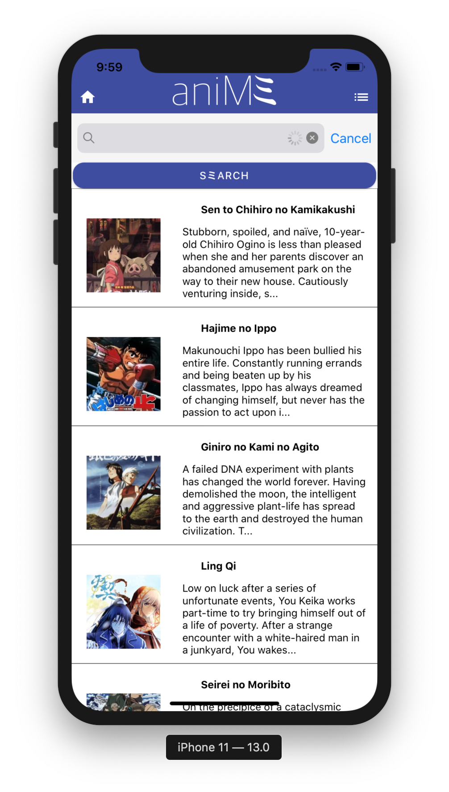
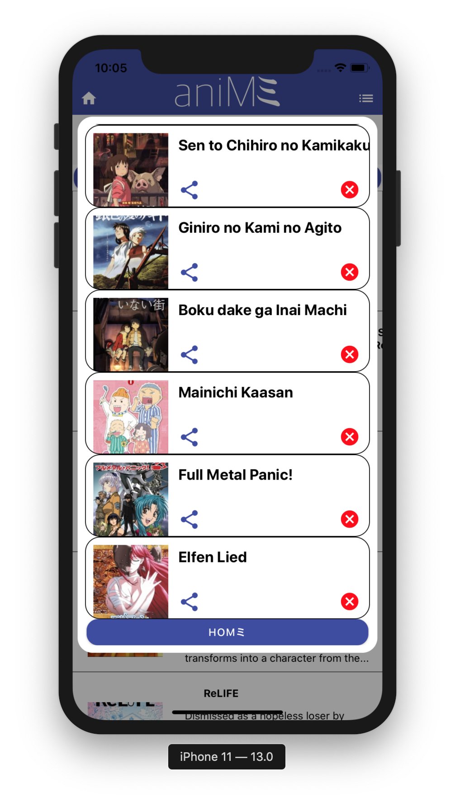

# AniMミ

AniMミ is an app that simplifies the process for searching and saving anime suggestions. It provides functionality for English and Japanese titles.

## Tech Stack
### front end
 * React Native
 * React Native-Elements
### back end
 * MySQL
 * Node.JS
 
## Prerequisites
Before you run pre-production code, ensure you have met the following requirements:

- You have access to an Iphone simulator on your local machine via XCode.
- You have MySQL running on your local machine.
- You have NodeJS, [npm](https://www.npmjs.com/), and a code editor such as VScode. 

## Install and Run
Use the package manager [npm](https://www.npmjs.com/) to install all of the dependencies. Run the following command in your project directory.

```bash
npm install
```
After installing the dependencies, open MySQL and create a local database instance with the **schema.sql** file.

1. Login to your MySQL Shell
```
mysql -u root -p 
```
2. Create the new DB instance by running the following in your MySQL shell:
```
source schema.sql 
```
3.  Launch the project with your IOS simulator:
```
npm run expo start --ios
```
## Contact
You can contact me at [tyler.rhodes@aya.yale.edu](tyler.rhodes@aya.yale.edu)





